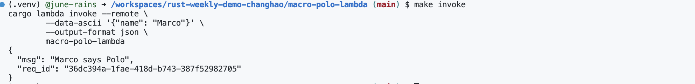

# ***Demo2 Marco Polo API with AWS MicroService***

In this project, we have built a  Marco Polo game API by using rust combing and deploy it to the AWS Lambda.  

To run this project, please follow below command line:  
* `make format`  
* `make lint`
* `make release-arm`
* `make deploy`

**result:**

