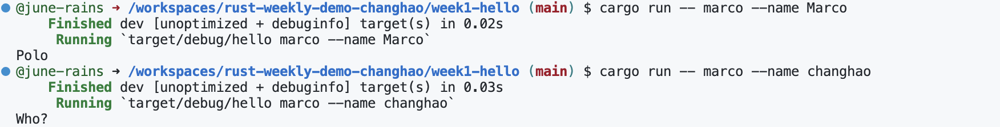

# ***Demo1 Hello***

In this project, we have built a command line tool to play Marco Polo game by using rust combing with copilot.  

To run this project, please follow below command line:  
* `make format` 
* `make lint`
* `cargo run -- --help` 
* `cargo run -- marco --name Marco`
* `cargo run -- marco --name Marco`

**result:**

