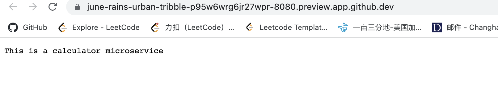
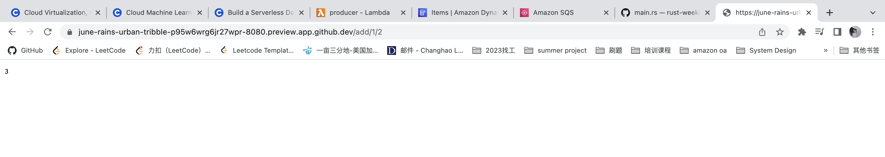
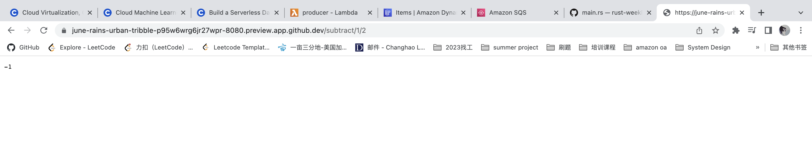
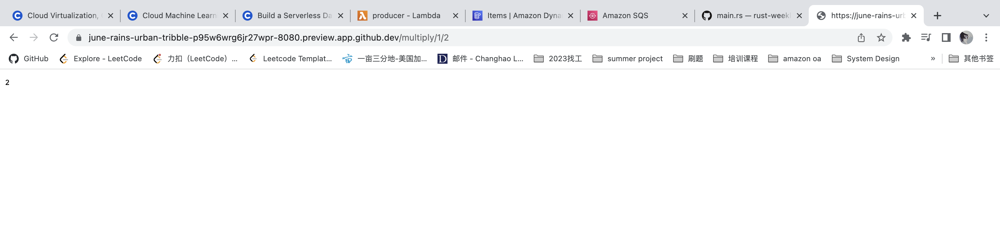
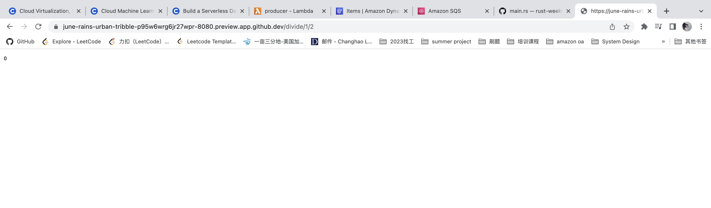

# ***Demo10 Rust Actix REST API***

In this project, we have re-built a  small project with actix framework and use REST API to implement the web calculator
To run this project, please follow below command line:  
* `cargo run`  

**result:**
* ***Index Page***  
    
* ***Add Page*** 
    
* ***Subtract Page***  
    
* ***Multiply Page***
      
* ***Divide Page*** 
    