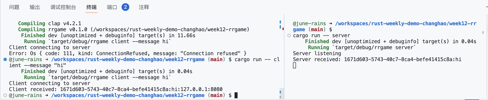

# ***Demo12 Rust rrgame***

build a Rust client server game for the terminal that lets you play the Roulette casino game with your friends.

To run this project, use following command: 
* `cargo run -- client --message "hi"`
* `cargo run -- server`

**result:**
