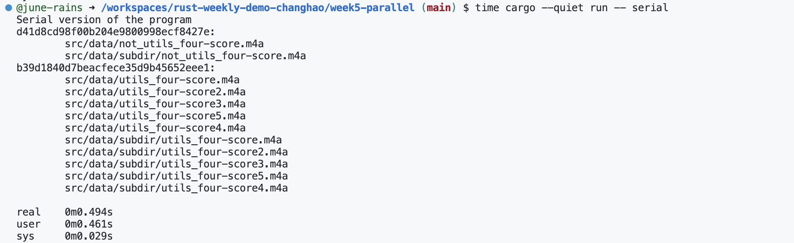

# ***Demo5 Rust Parallel***

In this project, we have re-built a  small project to test rust parallel  

To run this project, please follow below command line:  
* `time cargo --quiet run -- parallel`  
* `time cargo --quiet run -- serial`

**result:**

